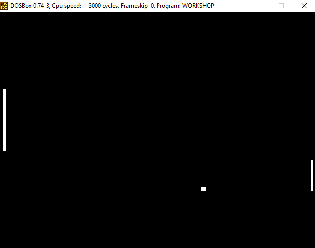

PiNG")
**Outernet's super offline bootable version of pong made in assembly**
- VESA Graphics (480p 16C)
- Keyboard handled with DOS interrupts
- Everything in NASM assembly
- Less than 1KB
- Just about as offline as it gets


## Building from Source
```
C:\parentDir\> cd noPiNG
C:\parentDir\noPiNG> build
     C:\parentDir\noPiNG> cd src
     C:\parentDir\noPiNG\src> nasm main.asm -fbin -o ../bin/out.com
     C:\parentDir\noPiNG\src> pause
   Press any key to continue . . .
     C:\parentDir\noPiNG\src> cd ../bin
     C:\parentDir\noPiNG\src> dosbox out.com
```
* DOSBox Will Open in Separate Window, .COM is in noPiNG/bin
    * Use CTRL + F11/F12 to slow down/speed up game
* Use [rufus](https://rufus.ie/en/) to make bootable for most systems


## Gameplay

```
emulator -> C:\parentDir\noPiNG\> run
hardware -> C:\> noping.com
```
* Its Pong, movement keys are W and S
    * Because we are running directly on hardware (no PS2 controller, interrupts only) and in 1980 nobody cared to add a repeat delay speed on keyboards of 0ms so controls can be funky
* If the controls are too difficult/too easy, the .data section in main.asm contains some constants that can make gameplay easier/harder (ie left_paddle_size, right_paddle_size, game_speed, ball_velocity)
* DOSBOX keyboard works as expected but when running on real hardware FreeDOS and MS DOS may both behave differently depending on your system, for example trying to boot the MS DOS version on a laptop with a modern architecture probably won't play nice, so try FreeDOS first
* Change clock speed in MS DOS or turn off turbo mode for easy mode